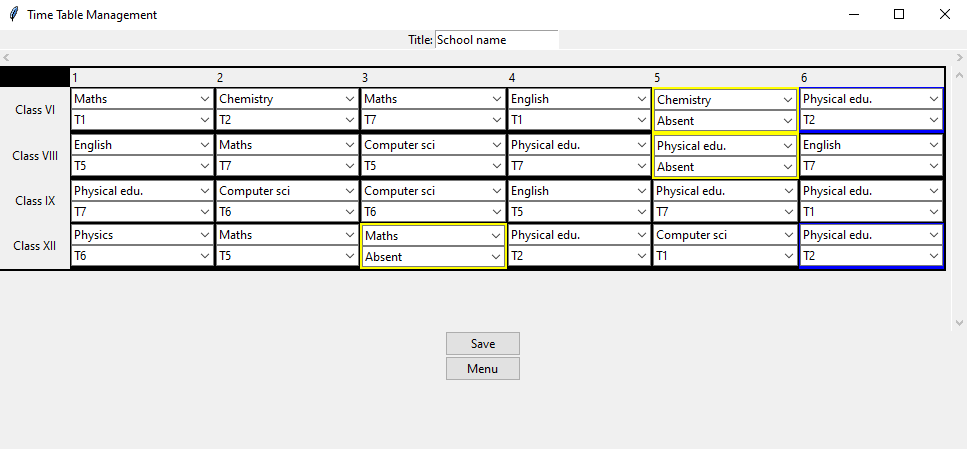
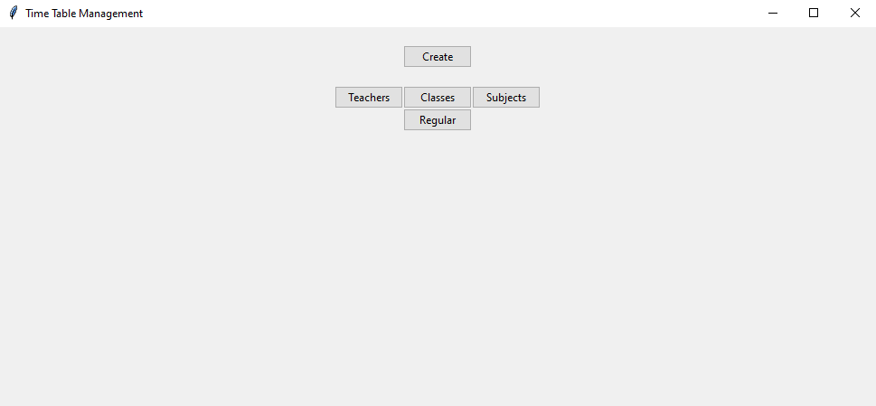
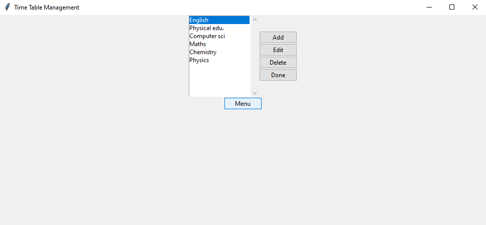
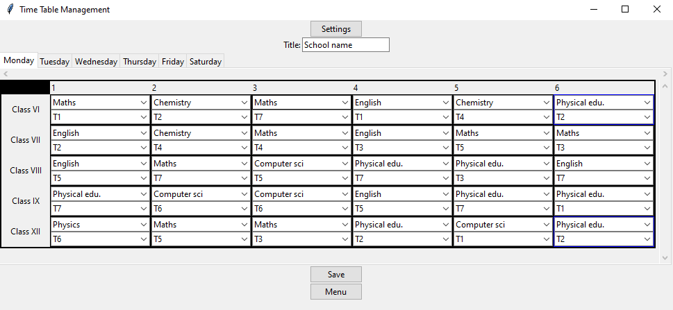
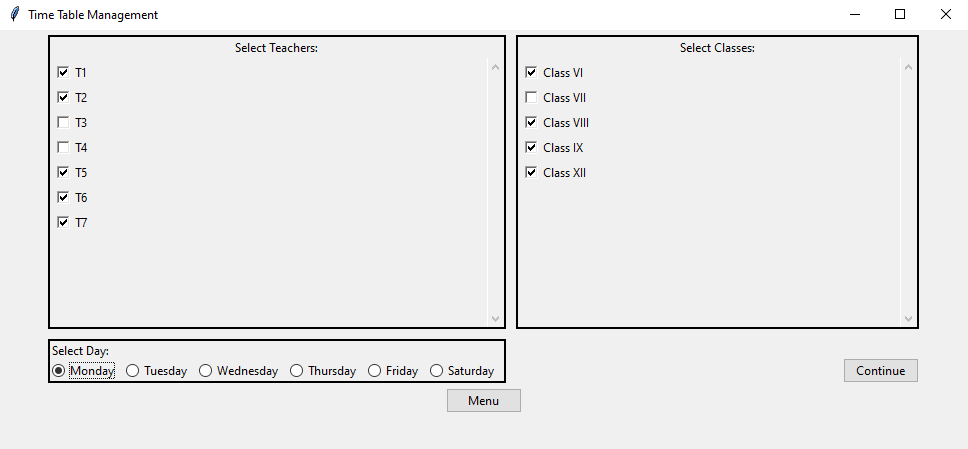
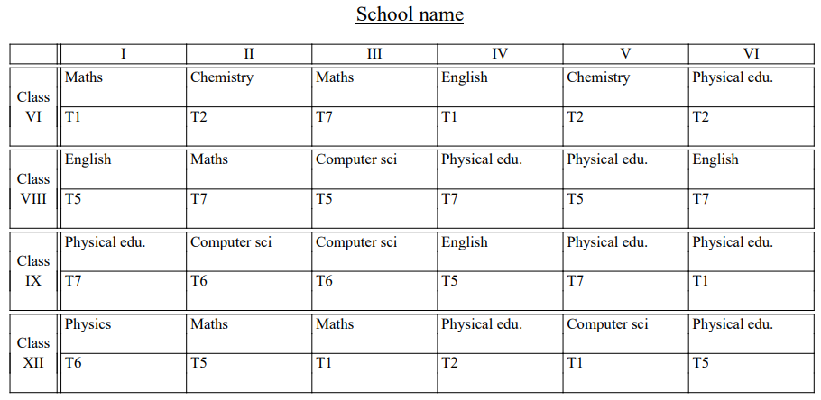

<h2 align="center">
  Time Table Manager 
</h2>

  

<h3 align="center">
    🔹
    <a href="https://github.com/princekdev/schooltimetablemanager/issues">Report Bug</a> &nbsp; &nbsp;
    🔹
    <a href="https://github.com/princekdev/schooltimetablemanager/issues">Request Feature</a>
</h3>

## Built

A Python application that seamlessly manages the time table for school considering the needs with an efficient mechanism to handle classes, subjects, teachers and to develop time-table on a regular basis. Implemented feature for effortlessly generating time-table pdf to be attached on the notice board.

This project was built using these technologies.

- Python
- Tkinter GUI
- FPDF
- VsCode

## Features

**🔨 Made with Python**

**📄 GUI application**

**💻 Minimal setup**

## Getting Started

1. Clone down this repository. You will need `git` installed on your machine.

2. Install `python`

3. Install `fpdf` library using pip

4. Run script.py

## How to use

1. Start the application with steps written above.

2. Main menu will appear.

3. Customise `Teachers`, `Classes` and `Subjects`

4. Setup a regular basis time table in `Regular`

5. Now you're done with setup. step ahead to `Create`

6. Check or uncheck on the basis of availability for the day. Select day of the week and click `Continue`.

7. Fill and prepare time table for the day with the help of indicators ( yellow color: absent teacher, blue: same teacher for more than one class ).

8. `Save` the time table pdf.

### Show your support

Give a ⭐ if you like this website!
